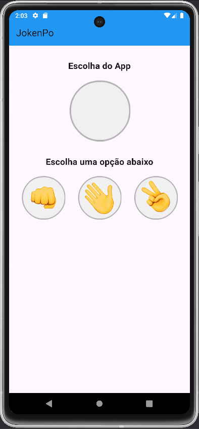
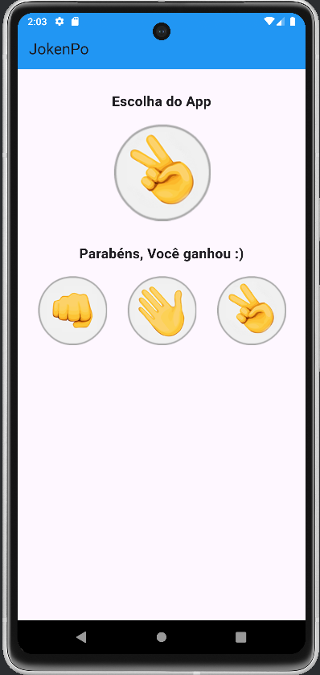
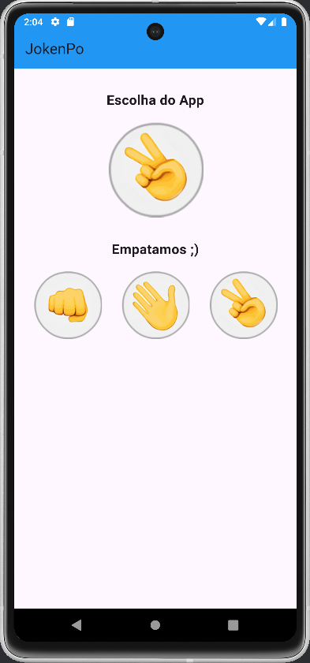
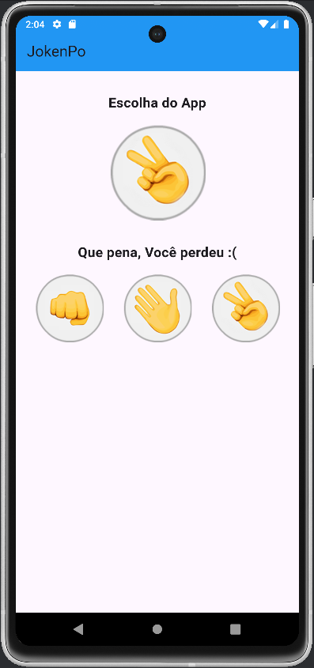

<h1 align="center" style="font-weight: bold;">Jogo Jokenpo em Flutter</h1>

Um jogo simples e funcional de Jokenpo (pedra, papel e tesoura) desenvolvido em Flutter, criado como estudo para explorar os fundamentos do framework. Este aplicativo simula o clássico jogo, onde o jogador escolhe entre pedra, papel ou tesoura e compete contra uma escolha aleatória do computador. O projeto tem como foco o aprendizado do uso do GestureDetector para capturar interações do usuário e de widgets de imagem para personalização visual, destacando-se pela simplicidade e clareza na implementação.

<h2>✨Funcionalidades</h2>

- Escolha entre pedra, papel ou tesoura.
- Feedback visual com telas indicando vitória, derrota ou empate.
- Animações e interações simples usando GestureDetector.

<h2>🚀 Tecnologias Utilizadas </h2>

- [Flutter](https://docs.flutter.dev/): framework principal para o desenvolvimento do app.
- [Dart](https://dart.dev/guides): linguagem de programação usada no projeto.
- Widgets do Flutter: como [GestureDetector](https://api.flutter.dev/flutter/widgets/GestureDetector-class.html) e [Image](https://api.flutter.dev/flutter/widgets/Image-class.html) para imagens personalizadas.

<h2>📷 Demonstrações </h2>

- Tela Inicial:
  


- Tela de Vitória:
  


- Tela de Empate:
  


- Tela de Derrota:
  


<h2>📦 Instalação e Execução</h2>

Para rodar este projeto localmente, siga os passos:  

1. Clone este repositório:  
   ```bash  
   git clone https://github.com/seu-usuario/jokenpo_flutter.git  
   ```
   
2. Acesse o diretório do projeto:  
   ```bash  
   cd jokenpo_flutter  
   ```
   
3. Instale as dependências:  
   ```bash  
   flutter pub get  
   ```
   
4. Execute o app:  
   ```bash  
   flutter run  
   ```

<h2>🎯 Objetivo do Estudo</h2>

Este projeto foi desenvolvido com o foco em:

- Entender e aplicar o GestureDetector para capturar interações de toque do usuário.
- Manipular e exibir imagens usando widgets nativos do Flutter.
- Aprimorar habilidades básicas em Flutter através de um projeto prático.

<h2>✉️ Dúvidas</h2>

Se você tiver alguma dúvida sobre este repositório, envie-a para trevizan.jaqueline@gmail.com.


